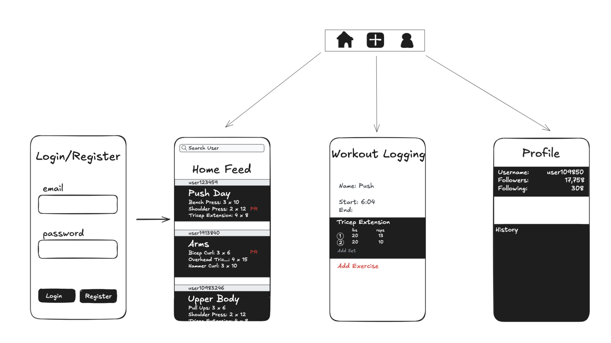

# Crucible

## Table of Contents

1. [Overview](#Overview)
2. [Product Spec](#Product-Spec)
3. [Wireframes](#Wireframes)
4. [Schema](#Schema)

## Overview

### Description

Crucible is a fitness app that makes tracking your workouts simple, consistent, and motivating. Users can log exercises with full detail and connect with friends to view their progress, compare stats, and celebrate milestones together.

### App Evaluation

[Evaluation of your app across the following attributes]
- **Category:** Health & Fitness
- **Mobile:** Mobile is central to the experience. Users are likely logging workouts at the gym or immediately after. Push notifications reinforce streaks and real-time updates from friends keep engagement high.
- **Story:** Users will track workouts, stay accountable, and get motivated by seeing what their friends are doing. The social layer fills a real gap in the fitness app space. People already screenshot workouts or stats to share in group chats—this app formalizes that behavior.
- **Market:** This app targets a specific niche: people who strength train regularly and care about tracking progress. Within that niche, the value is strong and the alternatives are weak—most apps are either solo-only or cardio-centric.
- **Habit:** Very strong habit potential. Serious users will log every workout, check the feed often, and look for feedback from friends. Logging becomes part of the post-set ritual. The inclusion of streaks, PR notifications, or light competition, encourages daily or near-daily engagement.
- **Scope:** The product is clearly scoped and realistically buildable within the program timeline. Logging, a social feed, and user accounts are technically straightforward.

## Product Spec

### 1. User Stories (Required and Optional)

**Required Must-have Stories**

* User can create an account and log in
* User can log a workout with details (date, time, exercises, sets, reps, weight)
* User can search for and follow/unfollow other users
* User can view a feed of workouts from followed users

**Optional Nice-to-have Stories**

* User can react to or comment on a friend’s workout
* User can view personal progress via charts or PR history
* User receives notifications when a friend logs a workout or hits a PR
* User earns streaks or badges for consistent logging
* User can update or delete a logged workout

### 2. Screen Archetypes

**Login / Register Screen**
*User can create an account and log in*
This is where users sign up for the app or log in with their credentials. Basic form validation is required, and successful login takes them to the main feed.

**Stream (Home Feed) Screen**
*User can view a feed of workouts from followed users*
This is the core screen of the app. It shows a vertical list of recent workouts logged by users they follow. Each item shows basic workout info and the user who posted it.

**Search Screen**
*User can search for and follow/unfollow other users*
A search bar allows users to look up others by username. Each result shows a follow/unfollow button. This enables users to populate their feed.

**Creation (Workout Logging) Screen**
*User can log a workout with details (date, time, exercises, sets, reps, weight)*
This is where users input their workout data. It includes multiple input fields for structured logging, and creates a new post visible to their followers.

**Profile Screen**
*User can view their own workout history and follow count*
Shows a user's own past workouts in a list, as well as follower/following counts. Useful for identity and self-tracking, though technically not required for MVP.

### 3. Navigation

**Tab Navigation** (Tab to Screen)

* Home Feed – displays recent workouts from followed users
* Log Workout – opens workout creation screen
* Profile – shows user’s own workout history and follower stats

---

**Flow Navigation** (Screen to Screen)

- [x] Login / Register Screen
* → Home Feed (after successful login or registration)
* → (optional) Error handling for invalid credentials

- [ ] Home Feed Screen
* → Profile Screen (when tapping on own profile image or username)
* → Other User's Profile (if tapping on another user in the feed)
* → (optional) Workout Detail Screen (if viewing more info on a workout)

- [ ] Log Workout Screen
* → Home Feed (after submitting a workout)

- [ ] Search Screen
* → Follow/Unfollow users from results
* → Other User's Profile Screen (if tapping on user)

- [ ] Profile Screen
* → Log Workout Screen (via CTA/button)
* → Search Screen (via header/search icon)
* → Follower/Following lists (optional in MVP)

- [ ] Other User’s Profile Screen
* → Follow/Unfollow
* → Home Feed (back)

---

## Wireframes

